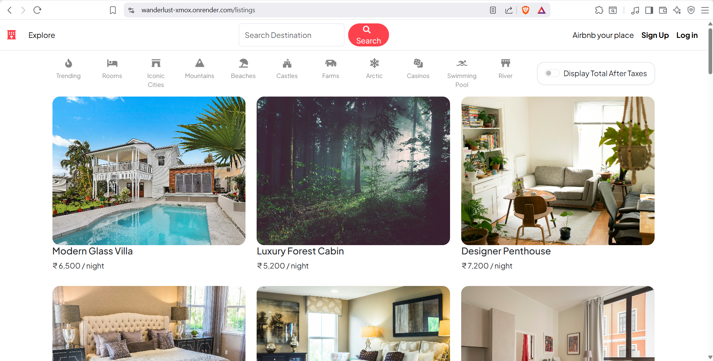
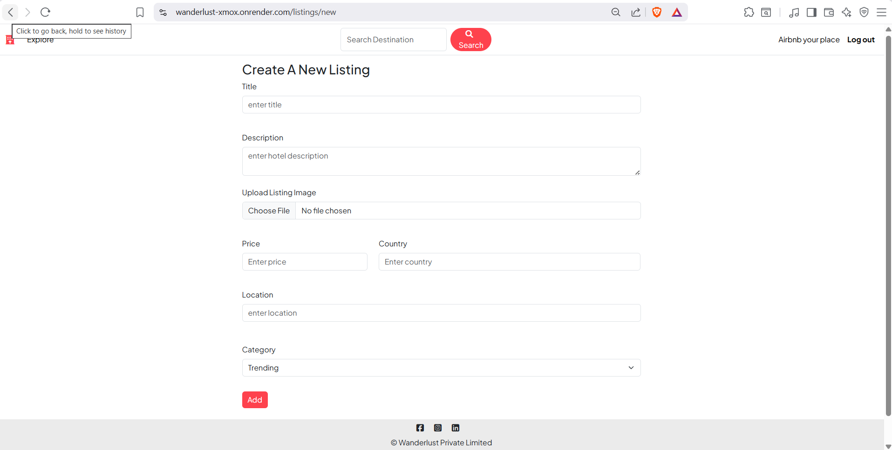
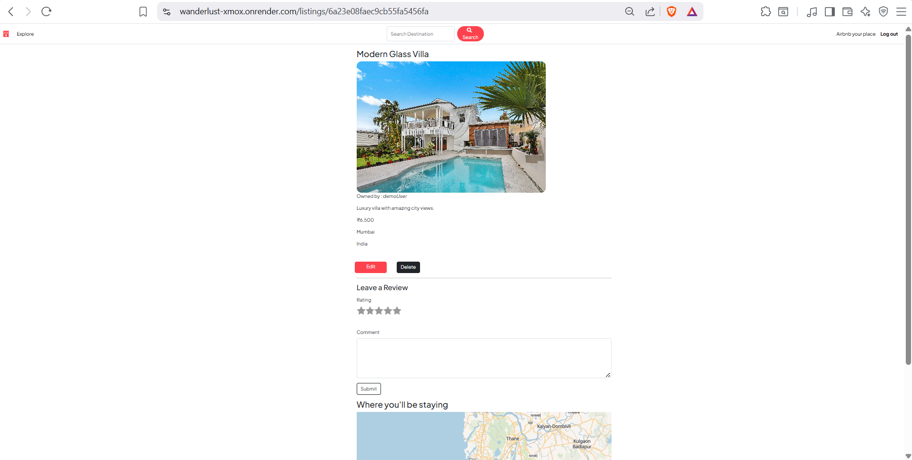

# 🌍 Wanderlust - Travel Listing Web App

A full-stack travel listing platform where users can create, explore, and manage travel stays.

---

## 🚀 Features
- User authentication (login / signup)
- Create, edit & delete listings
- Image upload support
- MongoDB database integration
- Responsive UI design

---

## 🛠 Tech Stack
- Node.js
- Express.js
- MongoDB Atlas
- EJS
- Bootstrap

---

## 📸 Screenshots

### Home Page



### SignUp Page


### Login Page


### New Listing Page


### Edit Page



---

## 🔗 Live Demo
https://wanderlust-xmox.onrender.com

---

## ⚙️ Run Locally

```bash
git clone https://github.com/Roshan0917/Wanderlust.git 
cd wanderlust
npm install

```
---

## 👨‍💻 Author

- Name: Roshan   

---

## ⭐ Support

If you like this project:
- ⭐ Star the repository
- 🍴 Fork it
- 🔔 Follow me on GitHub

---

## 💡 What I Learned
- Full-stack CRUD application development
- Authentication & authorization system
- MongoDB database integration
- MVC architecture in Node.js
- File upload handling
- Deployment basics

---

## 📌 Note

- This project is part of my full-stack web development learning journey.

---
