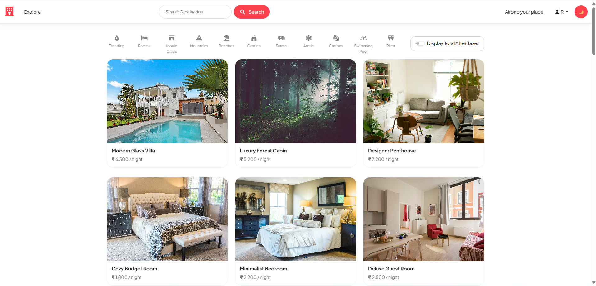
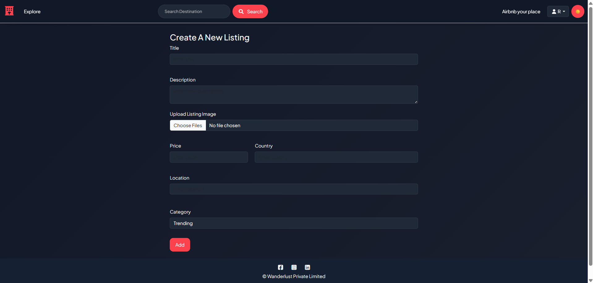
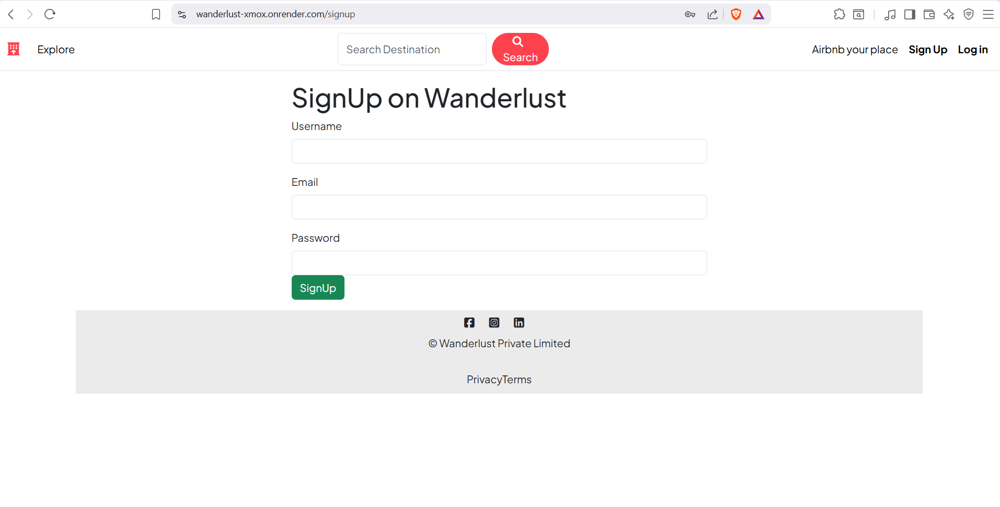
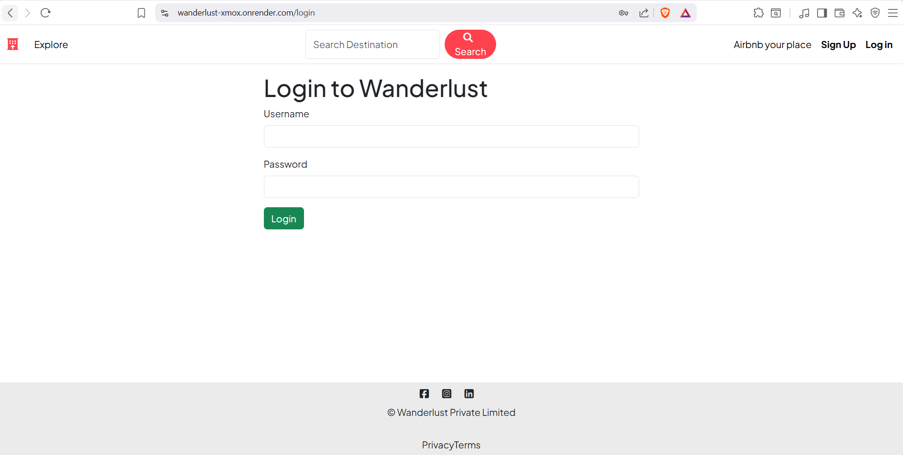
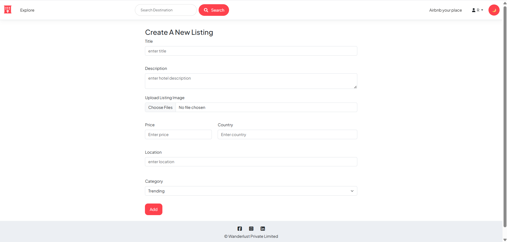
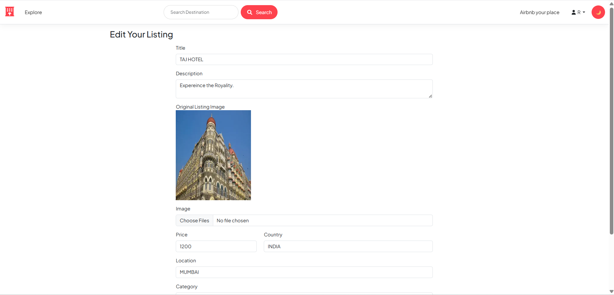
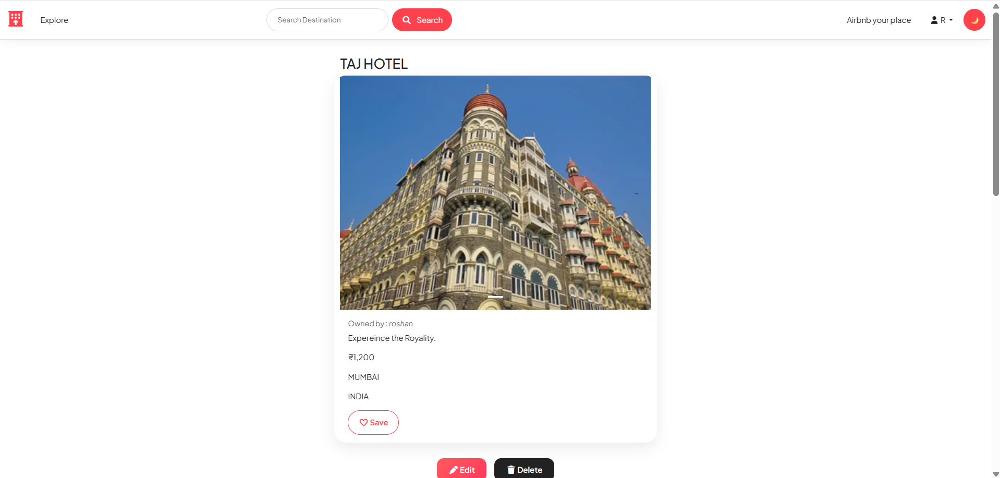
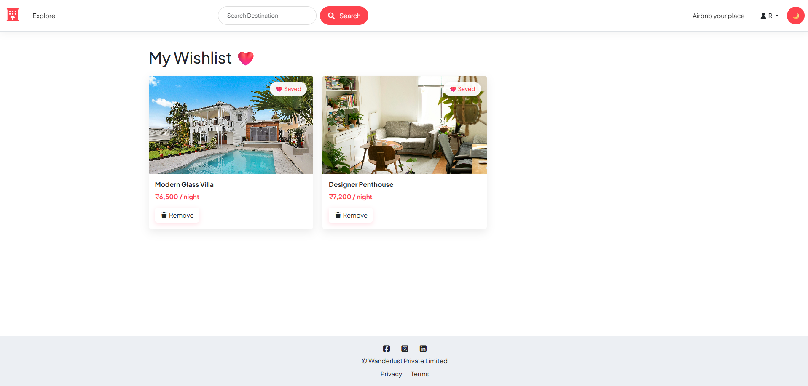
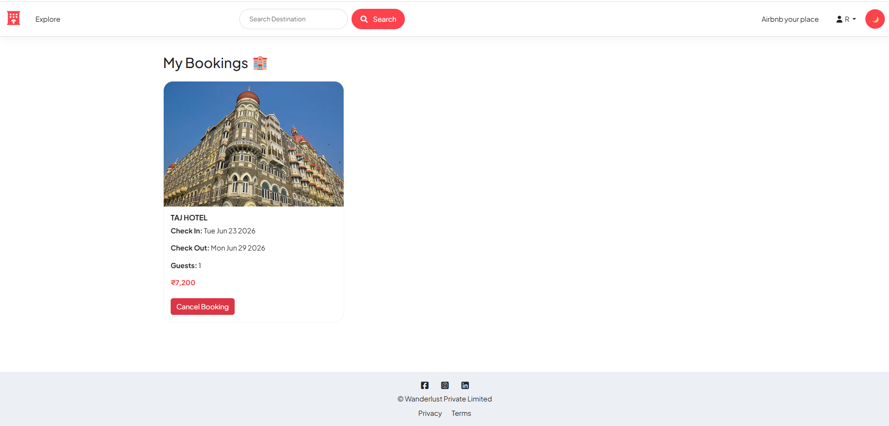
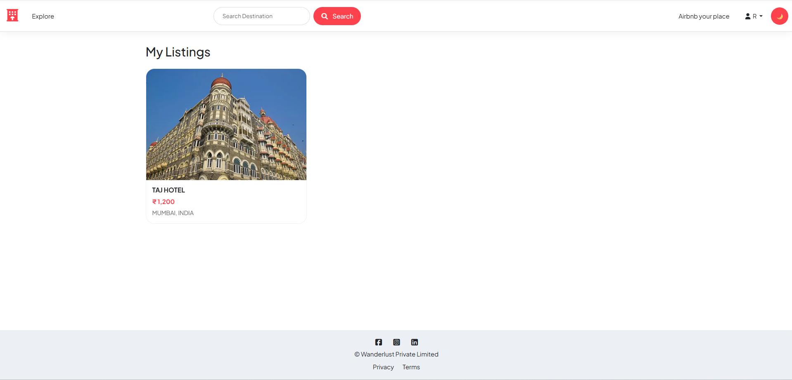

# 🌍 Wanderlust

Wanderlust is a full-stack travel accommodation platform inspired by Airbnb. Users can explore listings, create their own properties, manage bookings, maintain wishlists, and enjoy both Light and Dark themes.

---

## ✨ Features

* 🔐 User Authentication (Signup/Login/Logout)
* 🏡 Create, Edit and Delete Listings
* ❤️ Wishlist Functionality
* 📅 Booking Management
* 👤 Profile Dropdown Menu
* 🌙 Dark Mode / ☀️ Light Mode
* 📍 Interactive Maps
* ⭐ Ratings & Reviews
* 📱 Responsive Design
* 🔔 Flash Messages and Validation

---

## 🛠 Tech Stack

### Frontend

* HTML
* CSS
* Bootstrap 5
* EJS
* JavaScript

### Backend

* Node.js
* Express.js

### Database

* MongoDB
* Mongoose

### Authentication

* Passport.js
* Express Session

### Other Tools

* Cloudinary
* Multer
* MapLibre
* Joi Validation

---

## 📸 Screenshots

### 🏠 Home Page



### 🌙 Dark Mode



### 🔐 Sign Up Page



### 🔑 Login Page



### ➕ Create Listing



### ✏️ Edit Listing



### 🏡 Listing Details



### ❤️ Wishlist



### 📅 My Bookings



### 📋 My Listings



---

## 🚀 Installation

### Clone the repository

```bash
https://github.com/Roshan0917/Wanderlust.git 
```

### Move into the project folder

```bash
cd wanderlust
```

### Install dependencies

```bash
npm install
```

### Create a `.env` file and add:

```env
ATLASDB_URL=your_mongodb_connection_string
CLOUD_NAME=your_cloudinary_name
CLOUD_API_KEY=your_cloudinary_api_key
CLOUD_API_SECRET=your_cloudinary_secret
MAP_TOKEN=your_map_token
SECRET=your_session_secret
```

### Start the server

```bash
node app.js
```

Open:

```
http://localhost:8080
```

---

## 🌐 Live Demo

https://wanderlust-xmox.onrender.com

---

## 📂 Project Structure

```
Wanderlust
│
├── models
├── routes
├── controllers
├── views
├── public
├── utils
├── assets/screenshots
├── app.js
└── README.md
```

---

## 👨‍💻 Author

**Roshan**

---

### ⭐ If you like this project, don't forget to give it a star!

